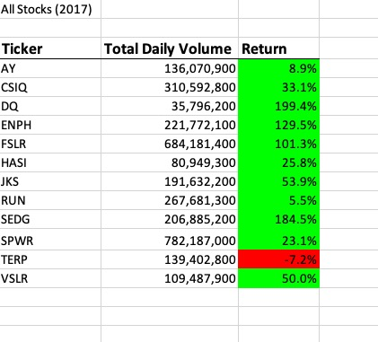
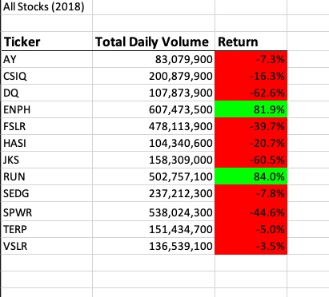
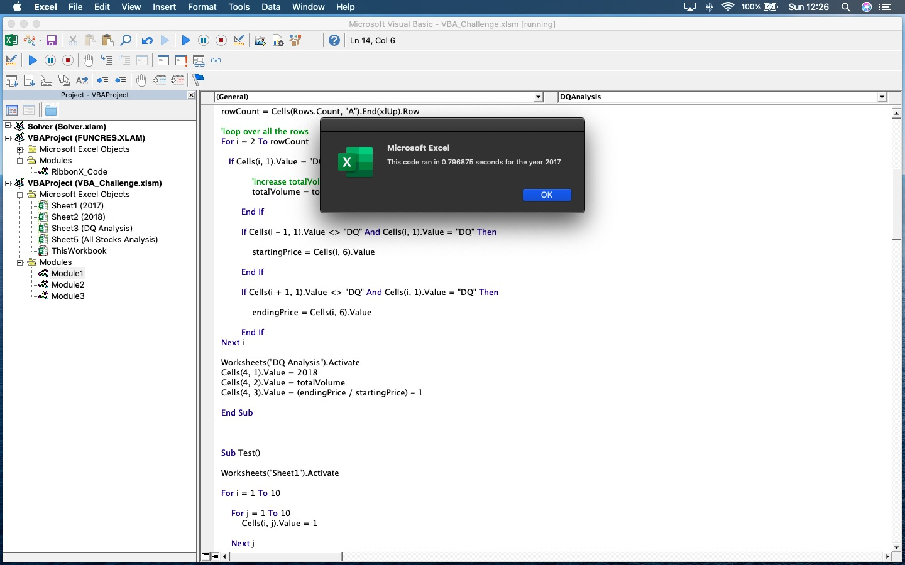
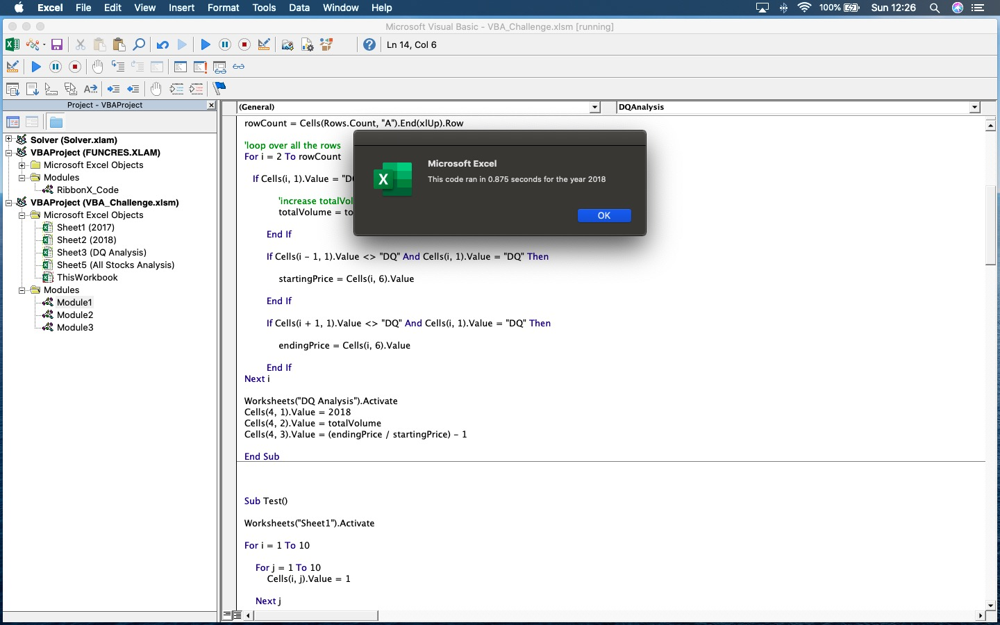
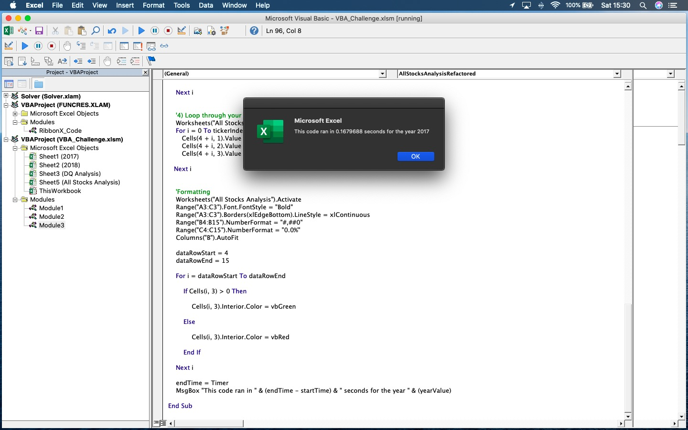
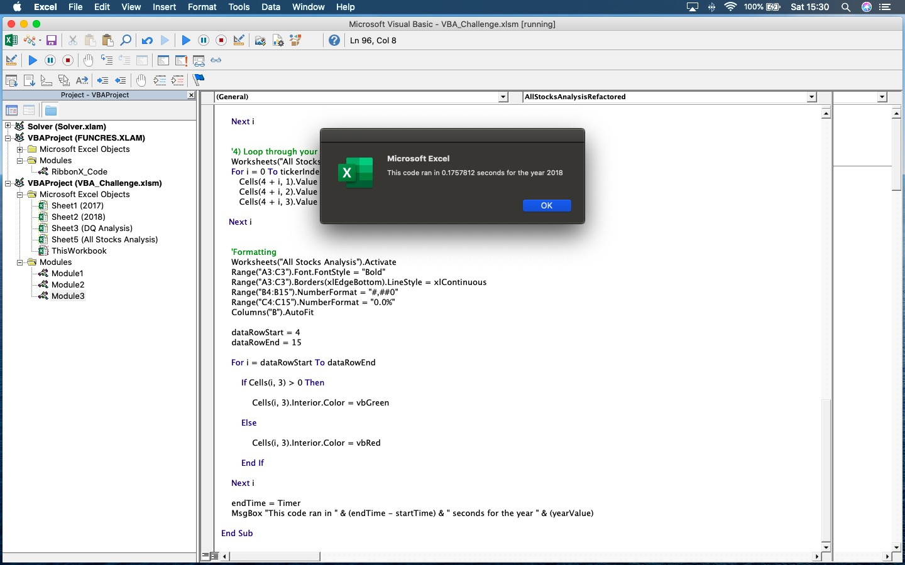

# **Stock-Analysis**
## **Overview of Project** 
The following analysis is focused  on the stock market field. We have been given a data set with data about a group of tickers for which we want to perform a study in order to gives us insight on how well these tickers are doing and determine whether or not they are worth investing in. The macro that has been created works for any number of stocks and it outputs fundamental data such as the Total Daily Volume and Returns for all tickers.

## **Results**

The following data observed in the two images for 2017 and 2018 represent the results of our analysis on the stock market. Based on this study we can observe that the year 2017 was overall an upstanding year for most of the Tickers in our study, especially DQ, ENPH, and SED which achieved over 100% of return. On the other hand, the year of 2018 tells a different story.  It can be noted that the percentage of return decreased significantly in average. This means that 2018 was an off year for the stock market as most of the stock prices dropped a significant amount. 

  

Orginally, we wrote code to run an analysis on the DQ Ticker, which was really insightful for the client. However, we were interested in being able to run this analysis for an unlimited number of tickers, therefore we made the macro more flexible for running multiple stocks.  

The following two images showcase the previous unrefactored code for the analysis with execution times of 0.797 and 0.875 sec for 2017 and 2018, respectively. 

After refactoring our code, we were able to drop the execution time to 0.168 and  0.176 sec for 2017 and 2018. 

### **Summary**

#### **Advantages of refactoring code**

* It allows us to use code that was originally written for another purpose but with a few adjustments can be recycled.
* After being refactored, our code should be more efficient and more to the point, which means that it will be easier for other people to understand it and ideally it will execute in less time.
  
#### **Disadvantage of refactoring code**

* Because we might be using code that was not originally written by us, we could easily break the code and it might be hard to understand it at first if it was not properly commented.

#### **Original code vs refactored code for the stock market analysis**

Our original code provided the basic information we needed for a few set of tickers; however, it lacked the ability to adapt to a different and larger data set. Additionally, it was not able to loop through the rows and set a ticker count to perform the analysis we wanted. 

After having refactored our code  we can say that the the new code provides more flexibility in the event we want to look at a different and larger set of stocks in the future and it has the ability to loop through all the rows, determine the ticker count, and output Total Daily Volume, and Return columns in our spreadsheet.